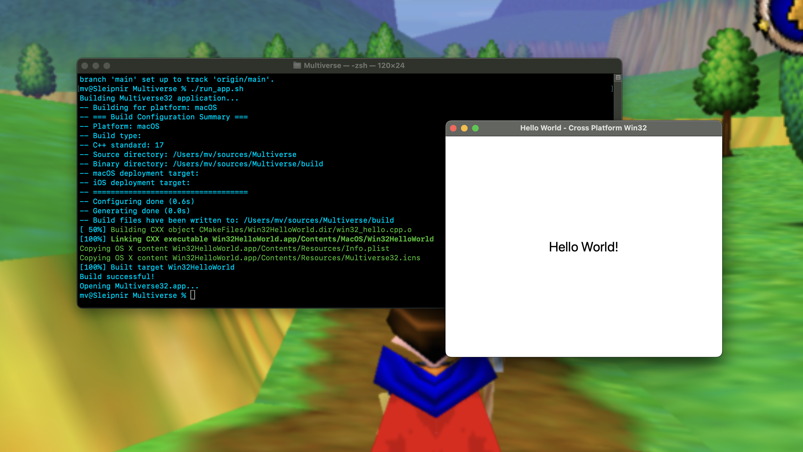

# Multiverse32

This project provides a complete Win32 API compatibility layer that allows you to write Win32 applications that compile and run on Windows, macOS, and iOS.



## Project Structure

```
project/
├── CMakeLists.txt          # Main CMake configuration
├── cmake/
│   └── ios.toolchain.cmake # iOS toolchain for cross-compilation
├── win32_compat.h          # Win32 API compatibility header
├── win32_hello.cpp         # Main application source
└── build/                  # Build directory (created during build)
```

## Prerequisites

### Windows
- Visual Studio 2019+ or MinGW-w64
- CMake 3.16+

### macOS
- Xcode 12+ with Command Line Tools
- CMake 3.16+

### iOS
- Xcode 12+ with iOS SDK
- CMake 3.16+

## Building

### Quick Start (Recommended)

For the easiest build experience, use the provided scripts:

#### Using build.sh (Cross-platform)
```bash
# Build for current platform (auto-detected)
./build.sh

# Build for specific platform
./build.sh --platform macos
./build.sh --platform windows
./build.sh --platform ios-device
./build.sh --platform ios-simulator

# Build with specific type
./build.sh --type Debug
./build.sh --type Release
```

#### Using run_app.sh (macOS only)
```bash
# Build and run the application on macOS
./run_app.sh
```

### Manual Build Instructions

If you prefer to build manually or need more control over the build process:

#### Windows (Visual Studio)

```bash
# Create build directory
mkdir build && cd build

# Generate Visual Studio project
cmake .. -G "Visual Studio 16 2019" -A x64

# Build the project
cmake --build . --config Release

# Run the executable
./Release/Win32HelloWorld.exe
```

### Windows (MinGW)

```bash
# Create build directory
mkdir build && cd build

# Generate MinGW Makefiles
cmake .. -G "MinGW Makefiles" -DCMAKE_BUILD_TYPE=Release

# Build the project
cmake --build .

# Run the executable
./Win32HelloWorld.exe
```

### macOS

```bash
# Create build directory
mkdir build && cd build

# Generate Unix Makefiles
cmake .. -DCMAKE_BUILD_TYPE=Release

# Build the project
cmake --build .

# Run the application
./Win32HelloWorld
```

### macOS (Xcode)

```bash
# Create build directory
mkdir build && cd build

# Generate Xcode project
cmake .. -G Xcode

# Build with Xcode
cmake --build . --config Release

# Open the app bundle
open Release/Win32HelloWorld.app
```

### iOS Device

```bash
# Create iOS device build directory
mkdir build-ios && cd build-ios

# Configure for iOS device
cmake .. \
    -G Xcode \
    -DCMAKE_TOOLCHAIN_FILE=../cmake/ios.toolchain.cmake \
    -DPLATFORM=OS64 \
    -DCMAKE_OSX_ARCHITECTURES=arm64

# Build for iOS device
cmake --build . --config Release

# The resulting .app bundle can be deployed to device via Xcode
```

### iOS Simulator

```bash
# Create iOS simulator build directory
mkdir build-ios-sim && cd build-ios-sim

# Configure for iOS simulator
cmake .. \
    -G Xcode \
    -DCMAKE_TOOLCHAIN_FILE=../cmake/ios.toolchain.cmake \
    -DPLATFORM=SIMULATOR64 \
    -DCMAKE_OSX_ARCHITECTURES=x86_64

# Build for iOS simulator
cmake --build . --config Release

# Deploy to simulator via Xcode
```

## License

This project is dual-licensed under:

1. **GNU General Public License v3.0 or later (GPL-3.0-or-later)** - for open source use
2. **Commercial License** - for proprietary/commercial use

See the [LICENSE](LICENSE) file for complete license terms and conditions.

For commercial licensing inquiries, please contact the copyright holder as specified in the LICENSE file.
